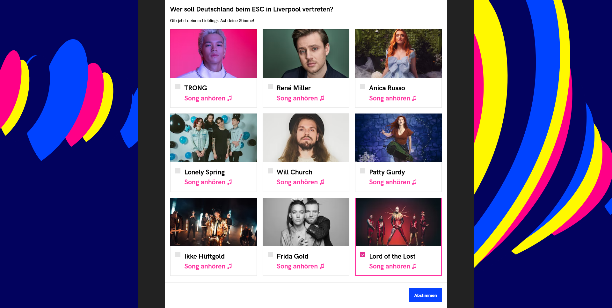

# ESC Vorentscheid Voting Tool

This year (2023) Germans are able to vote for their ESC act online. After I voted I realized that the system the NDR uses has to be attackable. After trying some stuff with selenium tests I realized I was right.

The captcha the NDR uses to test the user for being human is fully attackable. It is a SVG which contains 5 paths. 4 paths are the characters that need to be entered, one is a curvy line which should make picture recognition harder. 

But we do not need to analyze the symbol as it is drawn to attack it. The information the paths contain is already enough - and since the have unlimited trys to enter the correct 4 characters the system is fully attackable. The characters are not 100% the same everytime, they have a slightly different angle every time, but with some math this can be countered. 

I realized that every character should have nearly the same length every time - thus calculating the total distance the path tag contains lead to an algorithm that recognized that correct characters most of the time. As a second check (when multiple characters are likely) I check the length of the path string. For same characters those are mostly the same too.

This repository contains the code to fully automize the voting for an act (Lord of the Lost is preset but can be exchanged with any other act). 

# Explaination

Below you can see the starting page for the online voting tool. Here everything is easy, the Button with the text "Los Geht's!" starts the process

Before we can vote we need to have a look at all the possible acts for the show. The video can not be skipped and you can't jump around. Thus we need to wait until the video is finished - or we just wait until the button with the text "Weiter" at the bottom is enabled ;)

As you can see the "Weiter" button is enabled as soon as the video has finished.

Now it is getting serious. We have to select the act we want to vote for. Thankfully a button with the aria-label 'Lord of the Lost' (and for the other acts) exists which helps us to find the correct button.

After we clicked on an act, the "Abstimmen" button is enabled, thus we can check this too and click on it.

Now the tricky part begins. Below you can see the "humanity check". It is a SVG which contains 5 paths. One for the line, 4 for the characters. The possible characters are a-z, A-Z and 0-9.

Below you can see the HTML for the captcha.

After the captcha was entered correctly the vote is safed.

## Side Issues

- The user is remembered by the application via a cookie - thus we can just delete the cookie and are totally fine.

- How can we assume the characters correctly at first? We don't need to assume them correctly at the first time! While the captcha switches after it was entered wrong we are never locked out.

# The Math

## Calculating the distance of the character

We parse the path of the SVG and use the following formula:

Also I created a list with paths I parsed manually (characters.json) this contains at least 2 entries for each character and is used to check the character distance.